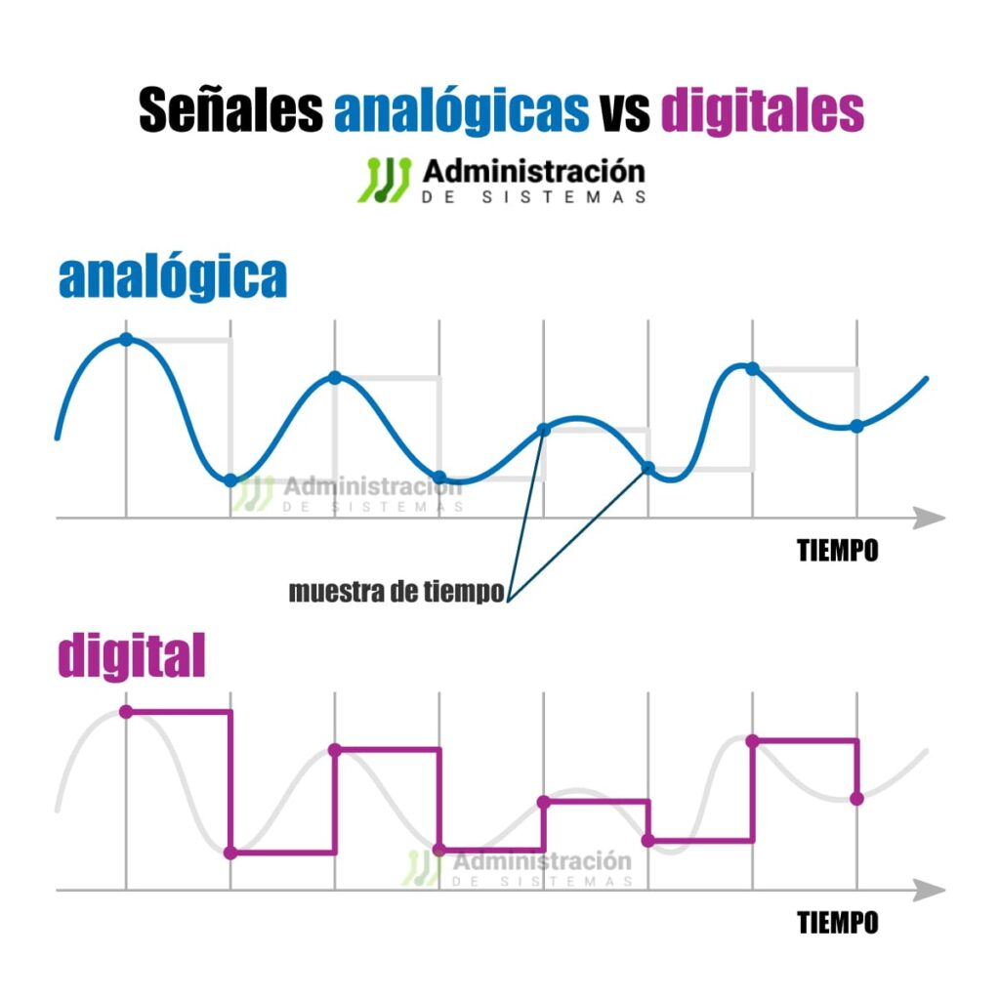

# Introducción Control Digital
La clase estuvo dirigida a comprender como es el control digital en comparacion al control análogo, por este motivo se revisaron temas como las señales análogas y digitales, las conversiones entre estas y los modelos matemáticos aplicados.
## 1. Control Digital
### 1.1. Señales Analógicas
Señal continua que puede tomar cualquier valor en el dominio del tiempo.
### 1.2. Señales Digitales
Señal que tiene solo 2 posibles valores o estados. Su forma de onda es cuadrada <br/>

💡**Figura 1:**
Las señales analógicas y digitales son dos formas fundamentales de representar y transmitir información en sistemas electrónicos.


Figura 1. Figura Tipos de Señales

## 2. ¿Por qué Control Digital?
Los controladores digitales ofrecen varias ventajas significativas que los hacen preferibles en muchas aplicaciones. Aquí se detallan las razones clave por las que se eligen los controladores digitales, relacionadas con tus puntos de interés:
### Exactitud:
Los controladores digitales pueden ofrecer una mayor exactitud en la medición y control de variables debido a la capacidad de procesar señales digitales de manera precisa y consistente. Esto se debe a que las señales digitales son menos propensas a la degradación y al ruido en comparación con las señales analógicas.
### Errores de implementación:
Aunque los controladores digitales pueden ser más complejos de implementar que los analógicos, su diseño y ajuste pueden ser más precisos y menos susceptibles a errores humanos una vez configurados. Las técnicas de implementación digital, como la aproximación rectangular y trapezoidal en controladores PID, permiten una mayor flexibilidad y precisión en el ajuste de parámetros.
### Flexibilidad:
Los controladores digitales son altamente flexibles. Pueden ser programados para realizar diversas tareas y ajustes, lo que los hace adecuados para una amplia gama de aplicaciones. Por ejemplo, pueden incluir funciones como temporizadores y rampas, permitiendo la automatización de procesos complejos.
### Velocidad:
La velocidad de procesamiento es una ventaja significativa de los controladores digitales. Pueden procesar y responder a señales de entrada mucho más rápidamente que los controladores analógicos, lo que es crucial en aplicaciones que requieren respuestas rápidas y precisas.
### Costos:
Aunque el costo inicial de un controlador digital puede ser mayor que el de uno analógico, a largo plazo, los controladores digitales pueden ser más económicos. Esto se debe a su capacidad para automatizar procesos, reducir la necesidad de intervención manual y mejorar la eficiencia general del sistema
## 4. Ejemplos
Si en algún caso pretende dar un ejemplo explicativo ya sea a través de texto o através de ecuaciones matemáticos, utilizar la palabra 'Ejemplo' seguido de una numeración consecutiva dentro de la clase. Utilice el emoji 💡 antecediendo la palabra.

## 5. Ecuaciones
Para la edición de ecuaciones debe utilizar la etiqueta '$$' al comienzo y final de la ecuación para que la ecuación quede centrada ocupando una línea. Si se quiere que la ecuación quede integrada en el texto debe utilizar la etiqueta '$' al comienzo y final de la ecuación. Las ecuaciones pueden ser editadas utilizando el código LATEX, en el siguiente enlace encuentran un editor de ecuaciones que les genera el código. http://www.alciro.org/tools/matematicas/editor-ecuaciones.jsp . Sin embargo hay muchas otras herramientas que pueden utilizar para esto.

💡**Ejemplo 1:** si se va a representar la ecuación de la ley de Ohm se puede mostrar así $R=\frac{V}{I}$ o también,

$$R=\frac{V}{I}$$

## 6. Figuras 


## 7. Tablas
En caso de necesitar la inclusión de tablas para organizar información se recomienda el uso de la herramienta del siguiente enlace https://www.tablesgenerator.com/markdown_tables , la cual permite organizar la información dentro de la tabla y genera el código markdown automáticamente:

💡**Ejemplo 3:** 

| **Resultado** | **x = número de intentos hasta primer éxito** |
|---------------|-----------------------------------------------|
|       S       |                       1                       |
|       FS      |                       2                       |
|      FFS      |                       3                       |
|      ...      |                      ...                      |
|    FFFFFFS    |                       7                       |
|      ...      |                      ...                      |

Tabla 1. Tabla de ejemplo

Cada tabla debe llevar la etiqueta que describa su contenido y numeración consecutiva para todas las tablas

## 8. Código
Teniendo en cuenta que el curso requiere del desarrollo de código matlab, c, c++ u otro. Si requiere incluir pequeños segmentos de código en los apuntes hágalos de la siguiente manera:

💡**Ejemplo 4:**
```
var sumar2 = function(numero) {
  return numero + 2;
}
```

## 9. Ejercicios
Deben agregar 2 ejercicios con su respectiva solución, referentes a los temas tratados en cada una de las clases. Para agregar estos, utilice la etiqueta #, es decir como un nuevo título dentro de la clase con la palabra 'Ejercicios'. Cada uno de los ejercicios debe estar numerado y con su respectiva solución inmediatamente despues del enunciado. Antes del subtitulo de cada ejercicio incluya el emoji 📚

## 10. Conclusiones
Agregue unas breves conclusiones sobre los temas trabajados en cada clase, puede ser a modo de resumen de lo trabajado o a indicando lo aprendido en cada clase

## 11. Referencias
Agregue un subtítulo al final donde pueda poner todas las referencias consultadas incluyendo el origen o fuente de los ejercicios planteados. Tambien dentro del texto referencie los textos o artículos consultados y las figuras y tablas dentro de la explicación de las mismas.
