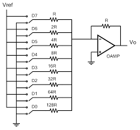

# Introducción Control Digital
La clase estuvo dirigida a comprender como es el control digital en comparacion al control análogo, por este motivo se revisaron temas como las señales análogas y digitales, las conversiones entre estas y los modelos matemáticos aplicados.
## 1. Control Digital
### 1.1. Señales Analógicas
Señal continua que puede tomar cualquier valor en el dominio del tiempo.
### 1.2. Señales Digitales
Señal que tiene solo 2 posibles valores o estados. Su forma de onda es cuadrada  

💡**Figura 1:**  

Figura 1. Señales analógicas y digitales

Las señales analógicas y digitales son dos formas fundamentales de representar y transmitir información en sistemas electrónicos.

### 1.3. 쯇or qué Control Digital?
Los controladores digitales ofrecen varias ventajas significativas que los hacen preferibles en muchas aplicaciones. Aquí se detallan las razones clave por las que se eligen los controladores digitales, relacionadas con tus puntos de interés:
#### Exactitud:
Los controladores digitales pueden ofrecer una mayor exactitud en la medición y control de variables debido a la capacidad de procesar señales digitales de manera precisa y consistente. Esto se debe a que las señales digitales son menos propensas a la degradación y al ruido en comparación con las señales analógicas.
#### Errores de implementación:
Aunque los controladores digitales pueden ser más complejos de implementar que los analógicos, su diseño y ajuste pueden ser más precisos y menos susceptibles a errores humanos una vez configurados. Las técnicas de implementación digital, como la aproximación rectangular y trapezoidal en controladores PID, permiten una mayor flexibilidad y precisión en el ajuste de parámetros.
#### Flexibilidad:
Los controladores digitales son altamente flexibles. Pueden ser programados para realizar diversas tareas y ajustes, lo que los hace adecuados para una amplia gama de aplicaciones. Por ejemplo, pueden incluir funciones como temporizadores y rampas, permitiendo la automatización de procesos complejos.
#### Velocidad:
La velocidad de procesamiento es una ventaja significativa de los controladores digitales. Pueden procesar y responder a señales de entrada mucho más rápidamente que los controladores analógicos, lo que es crucial en aplicaciones que requieren respuestas rápidas y precisas.
#### Costos:
Aunque el costo inicial de un controlador digital puede ser mayor que el de uno analógico, a largo plazo, los controladores digitales pueden ser más económicos. Esto se debe a su capacidad para automatizar procesos, reducir la necesidad de intervención manual y mejorar la eficiencia general del sistema

## 2. Conversión Análoga a Digital
### 2.1. Procedimiento de Conversión
* Muestreo: 
El muestreo es el proceso de tomar valores de una señal analógica (como voltaje) en momentos específicos.
* Cuantización:
La cuantización es el proceso de convertir los valores continuos de una señal analógica en valores discretos que pueden ser representados digitalmente.
* Codificación:
La codificación es el proceso de convertir los valores discretos de una señal cuantizada en códigos binarios, permitiendo su procesamiento y manipulación en sistemas digitales.

💡**Figura 2:**  

Figura 2. Muestreo, codificación y cuantizacion en ADC.

Los conversores analógico-digital convierten señales continuas en señales discretas que pueden ser procesadas por sistemas digitales, permitiendo la manipulación y análisis de datos en un formato que las computadoras pueden entender.

### 2.2 Consideraciones Prácticas:
Los conversores A/D comerciales tienen limitaciones inherentes en términos del rango de voltajes que pueden manejar y los tiempos de retraso asociados con el muestreo y la cuantización, lo que hace necesario considerar estos factores en el diseño y la selección de estos dispositivos para aplicaciones específicas.

### 2.3 Tiempo de Muestreador - Retenedor:
* Ta (tiempo de adquisición): es el tiempo que transcurre desde que se da la orden de muestreo hasta que se retiene dentro de cierto margen de tolerancia.
* Tp (tiempo de apertura): el tiempo que transcurre desde que se inicia la retención hasta que abre el muestreador.
* Ts (tiempo de establecimiento): El movimiento del interruptor puede crear una capactancia parásita, la cual a su vez puede producir un transitorio. El tiempo necesario para que la oscilación desaparezca se conoce como tiempo de establecimiento.

💡**Figura 3:**  

Figura 3. Tiempo de Muestreador - Retenedor.

El muestreador en un conversor ADC es responsable de tomar muestras periódicas de la señal analógica y retener estos valores para su posterior procesamiento, lo que es fundamental para la conversión precisa de señales analógicas a digitales.

## 3. Conversión Digital a Análoga
### 3.1. Conversor Digital/Analógico
Los conversores digitales a analogos (DAC) toman señales digitales y las convierte en señales analógicas, permitiendo que los dispositivos digitales interactúen con el mundo analógico.
* Resolución DAC: Determina la cantidad de niveles discretos que puede producir, lo que afecta directamente la precisión y la calidad de la señal de salida analógica.
### 3.2. Métodos de Conversión:
* **Resistencias ponderadas:** Utiliza una red de resistencias y conmutadores para convertir los bits del código digital en una señal analógica, sumando las            contribuciones ponderadas de cada bit para producir la tensión de salida.

💡**Figura 4:**  

Figura 4. Esquemático Resistencias ponderadas.

El método de resistencias ponderadas utiliza una red de resistencias y conmutadores para convertir los bits del código digital en una señal analógica, sumando las contribuciones ponderadas de cada bit para producir la tensión de salida.
 
 

* **Red escalera R-2R:** Es un tipo de circuito electrónico utilizado en convertidores digitales-analógicos (DAC), que se compone de resistencias con dos valores posibles R y 2R, estas resistencias se alternan en una configuración que se asemeja a una escalera.

💡**Figura 5:**  

Figura 5. Esquemático Red escalera R-2R.

El método de red escalera R-2R es un método eficiente para convertir señales digitales en analógicas, utilizando solo dos valores de resistencia y ofreciendo una buena precisión y velocidad.

## 4. Modelo Matemático
### 4.1. Modelo matemático conversores A/D y D/A
#### Muestreador: Toma muestras de la señal en momentos específicos.
* ADC: Muestra la señal analógica para convertirla en valores discretos.
* DAC: Procesa la señal digital en intervalos discretos.
#### Retenedor: Mantiene el valor de la muestra para su procesamiento.
* ADC: Retiene el valor de la muestra hasta su conversión en digital.
* DAC: Aunque no es explícito, la señal analógica generada se mantiene estable para su uso.
  
Estos componentes son esenciales para asegurar que las señales se procesen de manera precisa y consistente en ambos tipos de convertidores.

### 4.2. Zero Order Hold (ZOH)
El ZOH mantiene el valor de una muestra durante un período específico, llamado período de muestreo, hasta que se toma la siguiente muestra.

💡**Figura 6:**  

Figura 6. Zero Order Hold.

Matemáticamente el Zero Order Hold, se puede representar como una señal que es constante entre los puntos de muestreo, formando una serie de rectángulos.

### Funcion de Transferencia de ZOH
* **Dominio Z**

La función de transferencia del ZOH en el dominio Z se puede expresar como:

$$
H(z) = \frac{T_s (1 - z^{-1})}{z - 1} = \frac{T_s}{z}
$$

* **Dominio S**

La función de transferencia del ZOH en el dominio S se puede expresar como:

$$
H(s) = \frac{1 - e^{-sT_s}}{s}
$$

Estas funciones de transferencia capturan el comportamiento del ZOH en ambos dominios, discretos y continuos.

### 4.3. DAC de Orden Superior
- First order hold es un DAC que considera un modelo lineal durante el intervalo de muestreo.
- Second order hold es un DAC que considera un modelo parabólico durante el intervalo de tiempo de muestreo.

## 5. Conclusiones
* Resistencias Ponderadas: Utilizan resistencias con valores relacionados con el peso binario de cada bit, lo que puede ser complicado de fabricar para un número elevado de bits.
* Resistencias R/2R: Utilizan solo dos valores de resistencias, lo que las hace más económicas y fáciles de fabricar, con una mayor velocidad de funcionamiento y menor complejidad en la selección de componentes.
* Los conversores ADC y DAC son componentes críticos en la interfaz entre el mundo analógico y el mundo digital, permitiendo el procesamiento y análisis de señales en una variedad de aplicaciones. Su diseño y características influyen significativamente en su desempeño y precisión.
## 6. Referencias
[1] "Señales analógicas vs. señales digitales: Entendiendo las diferencias." Administracion de Sistemas. [En línea]. Disponible: https://administraciondesistemas.com/senales-analogicas-vs-digitales/  
[2] "03 Muestreo, Cuantificación y codificación en ADC." (28 de marzo de 2023). [Video en línea]. Disponible: https://www.youtube.com/watch?v=wce5Ine9a5o  
[3] "TuTronic. Funcionamiento del Convertidor digital a analógico R2R." (19 de mayo de 2015). [Video en línea]. Disponible: https://www.youtube.com/watch?app=desktop&amp;v=FNLnyGZOS10  
[4] "S. W. Mechatronics. The Zero Order Hold [EN]." (20 de abril de 2023). [Video en línea]. Disponible: https://www.youtube.com/watch?app=desktop&amp;v=4ytJaQ3YEVs  

