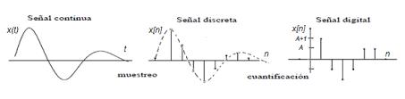
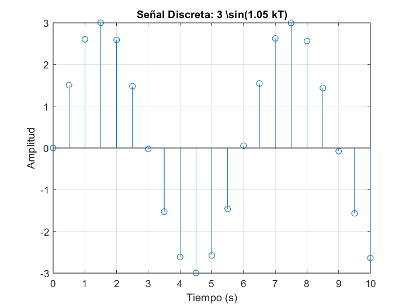
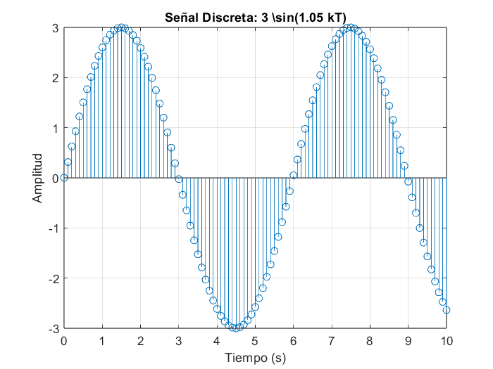
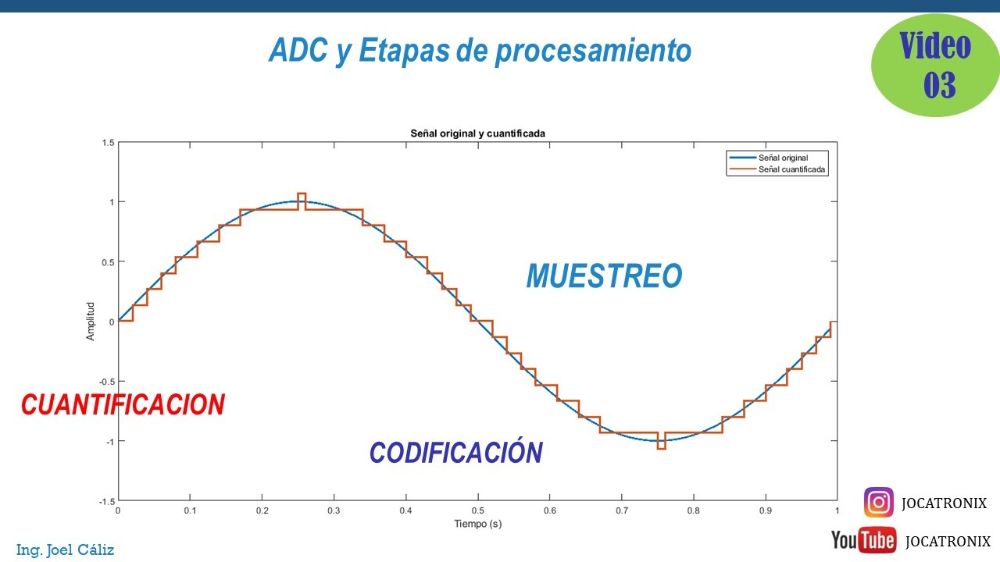

# Transformada Z de adelantos y atrasos
La clase estuvo dirigida a comprender la transformada Z y el manejo de retrasos y adelantos temporales, los cuales son herramientas poderosas para entender y manipular señales digitales, lo que es crucial en diversas aplicaciones de ingeniería y procesamiento de señales.
## 1. Tiempo continuo y discreto
### 1.1. Muestreo en términos matemáticos
Señal continua que puede tomar cualquier valor en el dominio del tiempo.

💡**Figura 1:**  

Figura 1. Señal continua representada a discreta

Las señales analógicas y digitales son dos formas fundamentales de representar y transmitir información en sistemas electrónicos.

### 1.2. Función en términos de muestras
Para estos casos T es el período de muestreo, el cual al ser menor se obtiene mas información sin embargo eso requiere mas potencia de procesamiento, esto mejora demasiado en la reconstrucción de la señal  

La función que estamos utilizando es:

$$
y = 3 \sin(1.05 \cdot k \cdot T)
$$

Donde:
- T = es el período de muestreo.

💡**Figura 2:**  

Figura 2. Señales analógicas y digitales

Señal en tiempo discreto con periodo de muestreo de T= 0.5 seg

💡**Figura 3:**  

Figura 3. Señales analógicas y digitales

Señal en tiempo discreto con periodo de muestreo de T= 0.1 seg

## 2. Representación matemática de los sistemas
Los controladores digitales ofrecen varias ventajas significativas que los hacen preferibles en muchas aplicaciones. Aquí se detallan las razones clave por las que se eligen los controladores digitales, relacionadas con tus puntos de interés:
### 2.1 Ecuación en diferencias:
Por medio de la ecuaciones en diferencias se representa la dinámica del sistema y el comportamiento de las señales de entrada (u) y salida (y).
### 2.2 Características ecuaciones en diferencias:
* Lineal, invariante en el tiempo, no homogénea 
* No lineal, invariante en el tiempo, homogénea 
* Lineal, variante en el tiempo, homogénea
### 2.3 Solución de ecuaciones en diferencias:
### Métodos iterativos:  

💡**Ejemplo 1:**  

$$
y(k) = \frac{1}{4} \left( -3y(k-1) + 2y(k-2) + u(k-1) - 2u(k-2) \right)
$$

#### Condiciones Iniciales

$$
(y(-2) = 3)
$$

$$
( y(-1) = -1)
$$

$$
( u(k) = 1 \) para \( k \geq 0 \)
$$

$$
( u(k) = 0 \) para \( k < 0 \)
$$

#### Cálculo de \( y(0) \)

Ya calculamos \( y(0) \) anteriormente:

$$
(y(0) = \frac{9}{4})
$$

#### Cálculo de \( y(1) \)

Sustituyendo \( k = 1 \) en la ecuación y utilizando las condiciones iniciales y el valor de \( y(0) \):

$$
(y(1) = \frac{1}{4} (-3y(0) + 2y(-1) + u(0) - 2u(-1)))
$$

$$
\[ y(1) = \frac{1}{4} \left( -3\left(\frac{9}{4}\right) + 2(-1) + 1 - 2(0) \right) \]
$$

$$
\[ y(1) = \frac{1}{4} \left( -\frac{27}{4} - 2 + 1 \right) \]
$$

$$
\[ y(1) = \frac{1}{4} \left( -\frac{27}{4} - 1 \right) \]
$$

$$
\[ y(1) = \frac{1}{4} \left( -\frac{31}{4} \right) \]
$$

$$
\[ y(1) = -\frac{31}{16} \]
$$

#### Cálculo de \( y(2) \)

Sustituyendo \( k = 2 \) en la ecuación y utilizando las condiciones iniciales y los valores de \( y(0) \) y \( y(1) \):

$$
\[ y(2) = \frac{1}{4} (-3y(1) + 2y(0) + u(1) - 2u(0)) \]
$$

$$
\[ y(2) = \frac{1}{4} \left( -3\left(-\frac{31}{16}\right) + 2\left(\frac{9}{4}\right) + 1 - 2(1) \right) \]
$$

$$
\[ y(2) = \frac{1}{4} \left( \frac{93}{16} + \frac{18}{4} - 1 \right) \]
$$

$$
\[ y(2) = \frac{1}{4} \left( \frac{93}{16} + \frac{72}{16} - \frac{16}{16} \right) \]
$$

$$
\[ y(2) = \frac{1}{4} \left( \frac{149}{16} \right) \]
$$

$$
\[ y(2) = \frac{149}{64} \]
$$

#### Resultados

Por lo tanto, los valores son:

$$
\( y(1) = -\frac{31}{16} \)
$$

$$
\( y(2) = \frac{149}{64} \)
$$

### Transformada Z: 
La solución numérica no permite identificar características generales del funcionamiento del sistema y es la contraparte discreta de LaPlace, el cual es un procedimiento similar a la solución de ecuaciones diferenciales y en donde la transformada Z es muy importante para el área de control.

* Atrasos: En el contexto de atrasos, la transformada Z es particularmente útil para entender cómo los sistemas discretos responden a retrasos o desplazamientos en el tiempo.
#### Ejemplo de Transformada Z de un Atraso

#### Señal Original

Supongamos que tenemos una señal discreta \( f(k) \) definida por:

$$
\[ f(k) = \delta(k) \]
$$

donde \( \delta(k) \) es la función delta de Dirac, que es 1 cuando \( k = 0 \) y 0 en cualquier otro caso.

#### Atraso de 2 Muestras

Queremos encontrar la transformada Z de la señal \( f(k) \) retrasada 2 muestras. La señal retrasada se denota como \( f(k-2) \).

#### Transformada Z de la Señal Original

La transformada Z de \( f(k) = \delta(k) \) es:

$$
\[ F(z) = \sum_{k=-\infty}^{\infty} f(k) z^{-k} = z^0 = 1 \]
$$

#### Transformada Z del Atraso

Según el teorema de desplazamiento temporal, si la señal original tiene una transformada Z \( F(z) \), entonces la transformada Z de la señal retrasada 2 muestras es:

$$
\[ F(z) \cdot z^{-2} \]
$$

Por lo tanto, la transformada Z de \( f(k-2) \) es:

$$
\[ F(z) \cdot z^{-2} = 1 \cdot z^{-2} = z^{-2} \]
$$

 
 

* Adelantos: Un adelanto en el tiempo se representa multiplicando la transformada Z original por \( z^k \), donde \( k \) es el número de muestras del adelanto.

#### Ejemplo de Transformada Z de un Adelanto

#### Señal Original

Supongamos que tenemos una señal discreta \( x(n) \) definida por:

$$
\[ x(n) = \delta(n) \]
$$

donde \( \delta(n) \) es la función delta de Dirac, que es 1 cuando \( n = 0 \) y 0 en cualquier otro caso.

#### Transformada Z de la Señal Original

La transformada Z de \( x(n) = \delta(n) \) es:

$$
\[ X(z) = \sum_{n=-\infty}^{\infty} x(n) z^{-n} = z^0 = 1 \]
$$

#### Adelanto de 2 Muestras

Queremos encontrar la transformada Z de la señal \( x(n) \) adelantada 2 muestras. La señal adelantada se denota como \( x(n + 2) \).

#### Transformada Z del Adelanto

Según la propiedad de adelanto temporal, la transformada Z de la señal adelantada 2 muestras es:

$$
\[ z^2 X(z) = z^2 \cdot 1 = z^2 \]
$$

## 3: Función de transferencia discreta
### 3.1. Funciones de transferencia en el dominio Z
La función de transferencia discreta es una herramienta matemática que describe cómo un sistema lineal e invariante en el tiempo responde a una entrada en el dominio discreto (es decir, en intervalos de tiempo discretos), por medio de esto se puede identificar el comportamiento del Sistema desde la identificación de parámetros.
### 3.2. Función de transferencia pulso
Describe la relación entre la entrada y la salida de un sistema discreto en el dominio Z, considerando el muestreo de señales y también permite analizar y diseñar sistemas de control discretos, especialmente en lazos cerrados, y predecir su comportamiento en respuesta a señales muestreadas.

💡**Figura 2:**  

Figura 2. Muestreo, codificación y cuantizacion en ADC.

## 5. Ejercicios
Deben agregar 2 ejercicios con su respectiva solución, referentes a los temas tratados en cada una de las clases. Para agregar estos, utilice la etiqueta #, es decir como un nuevo título dentro de la clase con la palabra 'Ejercicios'. Cada uno de los ejercicios debe estar numerado y con su respectiva solución inmediatamente despues del enunciado. Antes del subtitulo de cada ejercicio incluya el emoji 📚

## 6. Conclusiones
Agregue unas breves conclusiones sobre los temas trabajados en cada clase, puede ser a modo de resumen de lo trabajado o a indicando lo aprendido en cada clase

## 10. Referencias
[]
[]
[]
[]
[]
