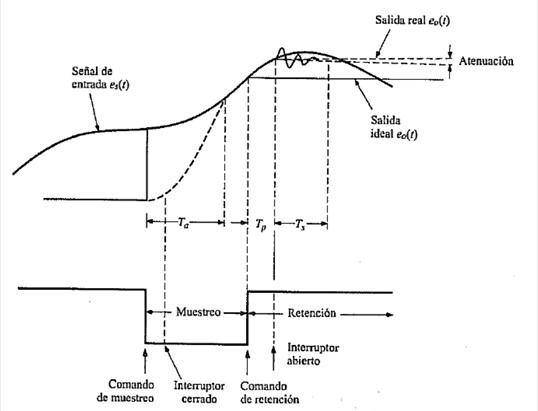
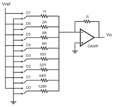
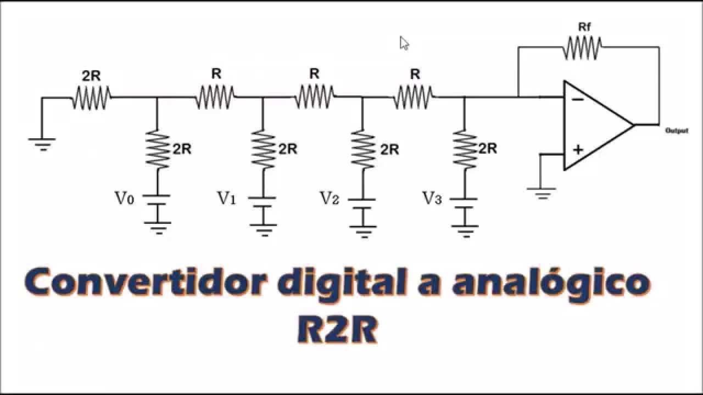
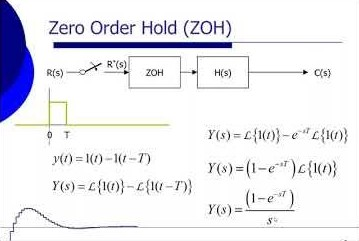

# Transformada Z de adelantos y atrasos
La clase estuvo dirigida a comprender la transformada Z y el manejo de retrasos y adelantos temporales, los cuales son herramientas poderosas para entender y manipular señales digitales, lo que es crucial en diversas aplicaciones de ingeniería y procesamiento de señales.
## 1. Tiempo continuo y discreto
### 1.1. Muestreo en términos matemáticos
Señal continua que puede tomar cualquier valor en el dominio del tiempo.

💡**Figura 1:**  

Figura 1. Señal continua representada a discreta

Las señales analógicas y digitales son dos formas fundamentales de representar y transmitir información en sistemas electrónicos.

### 1.2. Función en términos de muestras
Para estos casos T es el período de muestreo, el cual al ser menor se obtiene mas información sin embargo eso requiere mas potencia de procesamiento, esto mejora demasiado en la reconstrucción de la señal  

La función que estamos utilizando es:

$$
y = 3 \sin(1.05 \cdot k \cdot T)
$$

Donde:
- T = es el período de muestreo.

💡**Figura 2:**  

Figura 2. Señales analógicas y digitales

Señal en tiempo discreto con periodo de muestreo de T= 0.5 seg

💡**Figura 3:**  

Figura 3. Señales analógicas y digitales

Señal en tiempo discreto con periodo de muestreo de T= 0.1 seg

## 2. Representación matemática de los sistemas
Los controladores digitales ofrecen varias ventajas significativas que los hacen preferibles en muchas aplicaciones. Aquí se detallan las razones clave por las que se eligen los controladores digitales, relacionadas con tus puntos de interés:
### 2.1 Ecuación en diferencias:
Por medio de la ecuaciones en diferencias se representa la dinámica del sistema y el comportamiento de las señales de entrada (u) y salida (y).
### 2.2 Características ecuaciones en diferencias:
* Lineal, invariante en el tiempo, no homogénea 
* No lineal, invariante en el tiempo, homogénea 
* Lineal, variante en el tiempo, homogénea
### 2.3 Solución de ecuaciones en diferencias:
* Métodos iterativos:

$$
y(k) = \frac{1}{4} \left( -3y(k-1) + 2y(k-2) + u(k-1) - 2u(k-2) \right)
$$

# Condiciones Iniciales

$$
(y(-2) = 3)
$$
- \( y(-1) = -1 \)
- \( u(k) = 1 \) para \( k \geq 0 \)
- \( u(k) = 0 \) para \( k < 0 \)

## Cálculo de \( y(0) \)

Ya calculamos \( y(0) \) anteriormente:
\[ y(0) = \frac{9}{4} \]

## Cálculo de \( y(1) \)

Sustituyendo \( k = 1 \) en la ecuación y utilizando las condiciones iniciales y el valor de \( y(0) \):

\[ y(1) = \frac{1}{4} (-3y(0) + 2y(-1) + u(0) - 2u(-1)) \]

\[ y(1) = \frac{1}{4} \left( -3\left(\frac{9}{4}\right) + 2(-1) + 1 - 2(0) \right) \]

\[ y(1) = \frac{1}{4} \left( -\frac{27}{4} - 2 + 1 \right) \]

\[ y(1) = \frac{1}{4} \left( -\frac{27}{4} - 1 \right) \]

\[ y(1) = \frac{1}{4} \left( -\frac{31}{4} \right) \]

\[ y(1) = -\frac{31}{16} \]

## Cálculo de \( y(2) \)

Sustituyendo \( k = 2 \) en la ecuación y utilizando las condiciones iniciales y los valores de \( y(0) \) y \( y(1) \):

\[ y(2) = \frac{1}{4} (-3y(1) + 2y(0) + u(1) - 2u(0)) \]

\[ y(2) = \frac{1}{4} \left( -3\left(-\frac{31}{16}\right) + 2\left(\frac{9}{4}\right) + 1 - 2(1) \right) \]

\[ y(2) = \frac{1}{4} \left( \frac{93}{16} + \frac{18}{4} - 1 \right) \]

\[ y(2) = \frac{1}{4} \left( \frac{93}{16} + \frac{72}{16} - \frac{16}{16} \right) \]

\[ y(2) = \frac{1}{4} \left( \frac{149}{16} \right) \]

\[ y(2) = \frac{149}{64} \]

## Resultados

Por lo tanto, los valores son:

- \( y(1) = -\frac{31}{16} \)
- \( y(2) = \frac{149}{64} \)
* Transformada Z:
#### Velocidad:
La velocidad de procesamiento es una ventaja significativa de los controladores digitales. Pueden procesar y responder a señales de entrada mucho más rápidamente que los controladores analógicos, lo que es crucial en aplicaciones que requieren respuestas rápidas y precisas.
#### Costos:
Aunque el costo inicial de un controlador digital puede ser mayor que el de uno analógico, a largo plazo, los controladores digitales pueden ser más económicos. Esto se debe a su capacidad para automatizar procesos, reducir la necesidad de intervención manual y mejorar la eficiencia general del sistema

## 2. Conversión Análoga a Digital
### 2.1. Procedimiento de Conversión
* Muestreo: 
El muestreo es el proceso de tomar valores de una señal analógica (como voltaje) en momentos específicos.
* Cuantización:
La cuantización es el proceso de convertir los valores continuos de una señal analógica en valores discretos que pueden ser representados digitalmente.
* Codificación:
La codificación es el proceso de convertir los valores discretos de una señal cuantizada en códigos binarios, permitiendo su procesamiento y manipulación en sistemas digitales.

💡**Figura 2:**  

Figura 2. Muestreo, codificación y cuantizacion en ADC.

Los conversores analógico-digital convierten señales continuas en señales discretas que pueden ser procesadas por sistemas digitales, permitiendo la manipulación y análisis de datos en un formato que las computadoras pueden entender.

### 2.2 Consideraciones Prácticas:
Los conversores A/D comerciales tienen limitaciones inherentes en términos del rango de voltajes que pueden manejar y los tiempos de retraso asociados con el muestreo y la cuantización, lo que hace necesario considerar estos factores en el diseño y la selección de estos dispositivos para aplicaciones específicas.

### 2.3 Tiempo de Muestreador - Retenedor:
* Ta (tiempo de adquisición): es el tiempo que transcurre desde que se da la orden de muestreo hasta que se retiene dentro de cierto margen de tolerancia.
* Tp (tiempo de apertura): el tiempo que transcurre desde que se inicia la retención hasta que abre el muestreador.
* Ts (tiempo de establecimiento): El movimiento del interruptor puede crear una capactancia parásita, la cual a su vez puede producir un transitorio. El tiempo necesario para que la oscilación desaparezca se conoce como tiempo de establecimiento.

💡**Figura 3:**  

Figura 3. Tiempo de Muestreador - Retenedor.

El muestreador en un conversor ADC es responsable de tomar muestras periódicas de la señal analógica y retener estos valores para su posterior procesamiento, lo que es fundamental para la conversión precisa de señales analógicas a digitales.

## 3. Conversión Digital a Análoga
### 3.1. Conversor Digital/Analógico
Los conversores digitales a analogos (DAC) toman señales digitales y las convierte en señales analógicas, permitiendo que los dispositivos digitales interactúen con el mundo analógico.
* Resolución DAC: Determina la cantidad de niveles discretos que puede producir, lo que afecta directamente la precisión y la calidad de la señal de salida analógica.
### 3.2. Métodos de Conversión:
* **Resistencias ponderadas:** Utiliza una red de resistencias y conmutadores para convertir los bits del código digital en una señal analógica, sumando las            contribuciones ponderadas de cada bit para producir la tensión de salida.

💡**Figura 4:**  

Figura 4. Esquemático Resistencias ponderadas.

El método de resistencias ponderadas utiliza una red de resistencias y conmutadores para convertir los bits del código digital en una señal analógica, sumando las contribuciones ponderadas de cada bit para producir la tensión de salida.
 
 

* **Red escalera R-2R:** Es un tipo de circuito electrónico utilizado en convertidores digitales-analógicos (DAC), que se compone de resistencias con dos valores posibles R y 2R, estas resistencias se alternan en una configuración que se asemeja a una escalera.

💡**Figura 5:**  

Figura 5. Esquemático Red escalera R-2R.

El método de red escalera R-2R es un método eficiente para convertir señales digitales en analógicas, utilizando solo dos valores de resistencia y ofreciendo una buena precisión y velocidad.

## 4. Modelo Matemático
### 4.1. Modelo matemático conversores A/D y D/A
#### Muestreador: Toma muestras de la señal en momentos específicos.
* ADC: Muestra la señal analógica para convertirla en valores discretos.
* DAC: Procesa la señal digital en intervalos discretos.
#### Retenedor: Mantiene el valor de la muestra para su procesamiento.
* ADC: Retiene el valor de la muestra hasta su conversión en digital.
* DAC: Aunque no es explícito, la señal analógica generada se mantiene estable para su uso.
  
Estos componentes son esenciales para asegurar que las señales se procesen de manera precisa y consistente en ambos tipos de convertidores.

### 4.2. Zero Order Hold (ZOH)
El ZOH mantiene el valor de una muestra durante un período específico, llamado período de muestreo, hasta que se toma la siguiente muestra.

💡**Figura 6:**  

Figura 6. Zero Order Hold.

Matemáticamente el Zero Order Hold, se puede representar como una señal que es constante entre los puntos de muestreo, formando una serie de rectángulos.

### Funcion de Transferencia de ZOH
* **Dominio Z**

La función de transferencia del ZOH en el dominio Z se puede expresar como:

$$
H(z) = \frac{T_s (1 - z^{-1})}{z - 1} = \frac{T_s}{z}
$$

* **Dominio S**

La función de transferencia del ZOH en el dominio S se puede expresar como:

$$
H(s) = \frac{1 - e^{-sT_s}}{s}
$$

Estas funciones de transferencia capturan el comportamiento del ZOH en ambos dominios, discretos y continuos.

### 4.3. DAC de Orden Superior
- First order hold es un DAC que considera un modelo lineal durante el intervalo de muestreo.
- Second order hold es un DAC que considera un modelo parabólico durante el intervalo de tiempo de muestreo.

## 5. Ejercicios
Deben agregar 2 ejercicios con su respectiva solución, referentes a los temas tratados en cada una de las clases. Para agregar estos, utilice la etiqueta #, es decir como un nuevo título dentro de la clase con la palabra 'Ejercicios'. Cada uno de los ejercicios debe estar numerado y con su respectiva solución inmediatamente despues del enunciado. Antes del subtitulo de cada ejercicio incluya el emoji 📚

## 6. Conclusiones
Agregue unas breves conclusiones sobre los temas trabajados en cada clase, puede ser a modo de resumen de lo trabajado o a indicando lo aprendido en cada clase

## 10. Referencias
[]
[]
[]
[]
[]
