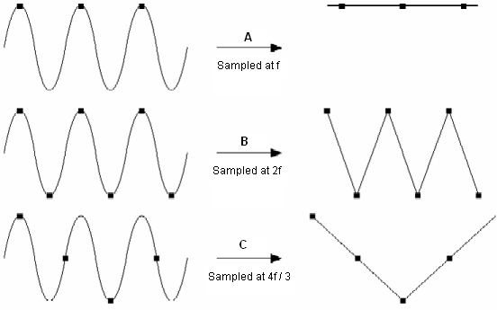
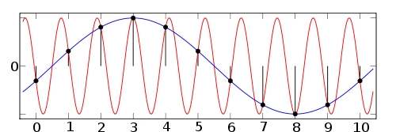

# Discretización de controladores Analógicos
La clase estuvo dirigida a comprnder el proceso de convertir un controlador continuo en uno discreto para que pueda ser implementado en sistemas digitales.
## 1. Método de Invarianza al impulso
### 1.1. Invarianza al impulso
El Método de Invarianza al Impulso es una técnica utilizada para convertir sistemas de control analógicos (continuos) en sistemas de control digitales (discretos) de manera que se preserve la respuesta al impulso del sistema original.

💡**Ejemplo 1:**  
* Sea la función de transferencia:

$$ H(s) = \frac{3(s + 4)}{(s + 2)(s + 5)} $$

* Descomposición en fracciones parciales:

$$ H(s) = \frac{A}{s + 2} + \frac{B}{s + 5} $$

* Transformada inversa de Laplace:

$$
\mathcal{L}^{-1} \{ H(s) \} = 2 e^{-2t} + e^{-5t}
$$

* Discretizando la ecuación:

$$
\mathcal{L}^{-1} \{ H(s) \ t = kT } = 2 e^{-2kT} + e^{-5kT}
$$

* Por lo tanto:

$$ 
C(z) = \mathcal{TZ}\{\(2 e^{-2KT} + e^{-5KT})\} 
$$

### 1.2. Invarianza al paso
La invarianza al paso en control digital se refiere a la propiedad de que un sistema o filtro digital mantiene su comportamiento o respuesta de manera consistente, independientemente del período de muestreo o la velocidad a la que se procesan las señales. En otras palabras, si un sistema es invariante al paso, su respuesta no cambia significativamente cuando se varía la frecuencia de muestreo.  

💡**Ejemplo 2:**  

$$
\[ C(s) = \frac{2(s - 2)}{(s + 1)(s + 3)} \]
$$

* Se divide por s para obtener la respuesta al escalón

$$
\[ \frac{C(s)}{s} = \frac{2(s - 2)}{s(s + 1)(s + 3)} \]
$$

* Se aplican fracciones parciales: 

$$
\[ \frac{C(s)}{s} = -\frac{4/3}{s} - \frac{3}{s + 1} - \frac{5/3}{(s + 3)} \]
$$

* La respuesta al paso en el tiempo es:

$$
\[ \mathcal{L}^{-1} { (\frac{C(s)}{s})} = -\frac{4}{3} - 3e^{-t} - \frac{5}{3} e^{-3t} \]
$$

* Por tablas de transformada Z:

$$
\[ \mathcal{Z} ({ \mathcal{L}^{-1} { \frac{C(s)}{s}} }) = -\frac{4/3 z}{z - 1} - \frac{3z}{z - e^{-T}} - \frac{5z}{3(z - e^{-3T})} \]
$$

* De la definición:

$$
\[ C(z) = \frac{z - 1}{z} ( -\frac{4/3 z}{z - 1} - \frac{3z}{z - e^{-T}} - \frac{5z}{3(z - e^{-3T})}) \]
$$

$$
\[ C(z) = \frac{0.116z - 0.523}{z^{2} - 0.830z + 0.135}]
$$

## 2. Método Euler Adelante
Es una técnica numérica simple para resolver ecuaciones diferenciales ordinarias en el contexto del control digital, si se tiene una ecuación que describe cómo cambia una variable con el tiempo, el método de Euler hacia adelante te permite calcular el valor de esa variable en el siguiente instante de tiempo discretizado. 

* La aproximacion discreta de la derivada es
  
$$
\[ \frac{d}{dkT} x(kT) \approx \frac{x(k + 1) - x(k)}{T} \]
$$

$$
\[ \mathcal{L} ({\frac{d}{dt} x(t)}) = sX(s)\]
$$

$$
\[ \mathcal{Z} ({ \frac{x(k + 1) - x(k)}{T} }) = \frac{zX(z) - X(z)}{T} = \frac{z - 1}{T} X(z) \]
$$

$$
\[ sX(s) \approx \frac{z - 1}{T} X(z) \]
$$

$$
\[ s \approx \frac{z - 1}{T} \]
$$

Teniendo en cuenta lo anterior un controlador estable en tiempocontinuo no necesariamente es estable en tiempo discreto

## 3. Método Euler Atrás
* La aproximacion discreta de la derivada es

$$
\[ \frac{d}{dkT} x(kT) = \frac{x(k) - x(k - 1)}{T} \]
$$

$$
\[ \mathcal{L} { \frac{d}{dt} x(t) } = sX(s) \]
$$

$$
\[ \mathcal{Z} { \frac{x(k) - x(k - 1)}{T} } = \frac{X(z) - z^{-1} X(z)}{T} = \frac{1 - z^{-1}}{T} X(z) \]
$$

$$
\[ sX(s) \approx \frac{1 - z^{-1}}{T} X(z) \]
$$

$$
\[ s \approx \frac{1 - z^{-1}}{T} = \frac{z - 1}{Tz} \]
$$

Teniendo en cuenta el metodo anterior, un controlador estable en tiempo continuo es estable en tiempo discreto.

## 4. Método trapezoidal “Tustin”
El Método Trapezoidal o de Tustin es una técnica numérica para discretizar sistemas continuos, convirtiéndolos en sistemas discretos, es fundamental en el análisis y control de sistemas, y se utiliza ampliamente en teoría de señales y control de procesos.

$$
\[ s = \frac{\frac{2}T (z - 1)}{z + 1} \]
$$

## 5. Teorema de Muestreo
### Teorema de muestreo de Nyquist
El teorema de muestreo de Nyquist-Shannon establece que, para reconstruir una señal de tiempo continuo a partir de sus muestras, la frecuencia de muestreo debe ser al menos el doble del ancho de banda de la señal. Esto permite la reconstrucción exacta de la señal original y evita el aliasing. Es un principio fundamental en la teoría de la información y el procesamiento de señales.

$$
\[ f_s > 2f_N \]
$$

💡**Figura 1:**  

Figura 1. Teorema de Nyquist 

### Aliasing

💡**Figura 2:**  

Figura 2. Aliasing 

Se evita subiendo la frecuencia de muestreo o agregando un filtro a la señal de entrada parea eliminar componentes que sean más altas que la frecuencia de muestreo.

### Muestreo en control

$$
\[ T_m < \frac{T_p}{10} \]
$$

$$
\[ T_m < \frac{T_s}{10} \]
$$

## 6. Conclusiones
* Es vital preservar la dinámica original del sistema al pasar al dominio digital.
* El período de muestreo debe seleccionarse cuidadosamente para balancear entre desempeño y complejidad.
* Es necesario considerar y, si es posible, compensar los errores de aproximación introducidos por la discretización.
* La estabilidad del sistema en el dominio Z debe ser evaluada y asegurada.
* La implementación digital ofrece numerosas ventajas, pero requiere un análisis cuidadoso durante la discretización.

## 7. Referencias
[1] "T. S. M. d. C. Rosario - Santa Fe - Argentina. “TECNOLOGÍA DIGITAL APLICADA AL AUDIO”. https://digital-audio-tech.blogspot.com/." [En línea]. Disponible: https://digital-audio-tech.blogspot.com/p/teorema-del-muestreo-nyquist.html  
[2] "Apuntes Clase - Lunes 29 Julio 2024"  
