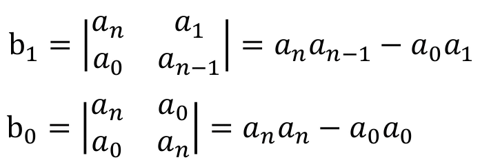

# Métodos Algebráicos
La clase estuvo dirigida a comprender la transformada Z y el manejo de retrasos y adelantos temporales, los cuales son herramientas poderosas para entender y manipular señales digitales, lo que es crucial en diversas aplicaciones de ingeniería y procesamiento de señales.
## 1. Igualacion de modelo por metodos algebraicos
El método algebraico por igualación de modelo es una técnica utilizada en la resolución de sistemas de ecuaciones lineales, particularmente en el contexto de la teoría de control y la modelación matemática. Este método permite encontrar los valores de las incógnitas en un sistema de ecuaciones al igualar expresiones derivadas de las mismas incógnitas. En control Si tenemos la función de lazo abierto G(z), que ya conocemos, y sabemos cuál es la respuesta que queremos lograr, expresada a través de la función de transferencia de lazo cerrado Go(z), se puede calcular la función de transferencia del controlador, C(z) que nos permitirá alcanzar ese comportamiento deseado. Sin embargo este metodo debe tener en cuenta las siguientes carateristicas:

### 1.1. Espacio LaPlace vs Z
La estabilidad es el mismo concepto en el espacio de LaPlace y de la Z, sin embargo la ubicacion de los polos es distinta. 

💡**Figura 1:**  

Figura 1. Estabilidad en el espacio de LaPlace

💡**Figura 2:**  

Figura 2. Estabilidad en el espacio de Z

💡**Ejemplo 1:**  

$$
\[ G(z) = \frac{4}{z^3 - 7.8z^2 + 13.4z + 3} \]
$$

Se busca la ubicacion de los polos:

$$
\[ z^3 - 7.8z^2 + 13.4z + 3 = 0 \]  
$$

z = 5

z = 3

z = -0.2

El Sistema es inestable debido a que hay 2 polos por fuera del círculo unitario

## 2. Estabilidad Asintótica
La estabiidad asintótica se refiere que a medida que el tiempo avanza, las variables del sistema convergen hacia un punto de equilibrio estable, garantiza que el sistema se estabilice en un punto de equilibrio estable a largo plazo, lo cual es crucial para el control y la estabilidad de sistemas dinámicos.

$$
\[ \lim_{k \to \infty} y(k) = 0 \]
$$

Si la respuesta se mantiene limitada pero no decae a 0, se dice que es marginalmente estable.

## 3. Estabilidad BIBO (Bounded input – Bounded Output)
### 3.1. Estabilidad BIBO
Es una propiedad de los sistemas que garantiza que, si se introduce una señal de entrada que no excede un cierto límite (acotada), la salida del sistema también permanecerá dentro de un límite razonable; es crucial porque garantiza que el sistema se comportará de manera predecible y controlada, incluso cuando se le aplican señales de entrada variadas pero acotadas.

$$
\[ |y(k)| = b \quad \text{para} \quad k = 0, 1, 2, \ldots \]
$$

$$
\[ 0 < b_y < \infty \]
$$

Donde 𝑏𝑦 es un número real o complejo que actúa como cota para y.

## 4. Test de Jury
El test de Jury es un método utilizado en teoría de control para determinar si un sistema de control discreto es estable. Para aplicar el criterio de Jury deben cumplirse todas las condiciones para afirmar que un sistema es estable

$$
\( a_0 > 0 \)
$$

$$
\(|a_n| > a_0 \)
$$

$$
P(z) z=1 > 0
$$

La condición para la estabilidad es que `P(z)` en `z = -1` debe satisfacer:
- `P(-1) > 0` para `n` par
- `P(-1) < 0` para `n` impar

### 4.1 Arreglo de Jury

💡**Ejemplo 2:**  

Tabla 1. Estabilidad en el espacio de LaPlace

## 5. Conclusiones
* La estabilidad en sistemas discretos se garantiza si todos los polos están dentro del círculo unitario en el plano Z.
* El período de muestreo tiene un impacto crítico en la estabilidad y debe ser elegido cuidadosamente.
* La discretización de un sistema continuo debe realizarse de forma que preserve la estabilidad del sistema.
* El análisis de estabilidad puede realizarse mediante herramientas como el criterio de Jury y el diagrama de polos y ceros en el plano Z.
* El diseño de controladores digitales debe tener en cuenta la estabilidad tanto en lazo abierto como cerrado.
## 6. Referencias
[1] "Apuntes Clase - Lunes 29 Julio 2024"
