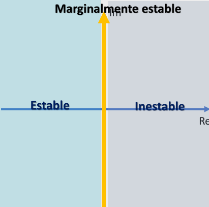
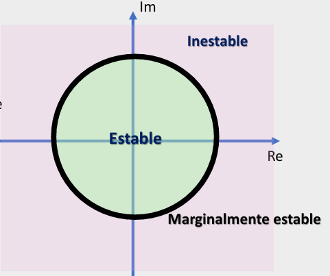
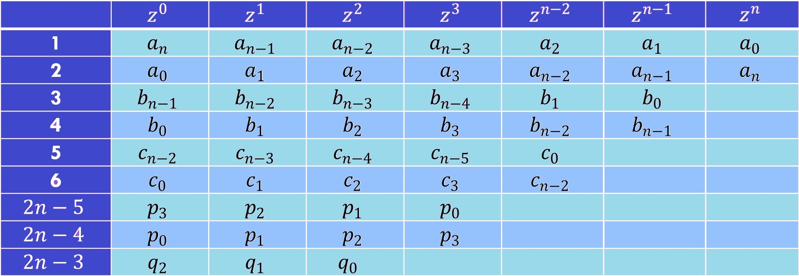

# Estabilidad en sistemas discretos
La clase estuvo dirigida a comprender la transformada Z y el manejo de retrasos y adelantos temporales, los cuales son herramientas poderosas para entender y manipular señales digitales, lo que es crucial en diversas aplicaciones de ingeniería y procesamiento de señales.
## 1. Estabilidad Absoluta
Un Sistema es estable cuando tiene una salida limitada producto de una entrada limitada.
### 1.1. Espacio LaPlace vs Z
La estabilidad es el mismo concepto en el espacio de LaPlace y de la Z, sin embargo la ubicacion de los polos es distinta. 

💡**Figura 1:**  

Figura 1. Estabilidad en el espacio de LaPlace

💡**Figura 2:**  

Figura 2. Estabilidad en el espacio de Z

💡**Ejemplo 1:**  

$$
\[ G(z) = \frac{4}{z^3 - 7.8z^2 + 13.4z + 3} \]
$$

Se busca la ubicacion de los polos:

$$
\[ z^3 - 7.8z^2 + 13.4z + 3 = 0 \]  
$$

z = 5

z = 3

z = -0.2

El Sistema es inestable debido a que hay 2 polos por fuera del círculo unitario

## 2. Estabilidad Asintótica
La estabiidad asintótica se refiere que a medida que el tiempo avanza, las variables del sistema convergen hacia un punto de equilibrio estable, garantiza que el sistema se estabilice en un punto de equilibrio estable a largo plazo, lo cual es crucial para el control y la estabilidad de sistemas dinámicos.

$$
\[ \lim_{k \to \infty} y(k) = 0 \]
$$

Si la respuesta se mantiene limitada pero no decae a 0, se dice que es marginalmente estable.

## 3. Estabilidad BIBO (Bounded input – Bounded Output)
### 3.1. Estabilidad BIBO
Es una propiedad de los sistemas que garantiza que, si se introduce una señal de entrada que no excede un cierto límite (acotada), la salida del sistema también permanecerá dentro de un límite razonable; es crucial porque garantiza que el sistema se comportará de manera predecible y controlada, incluso cuando se le aplican señales de entrada variadas pero acotadas.

$$
\[ |y(k)| = b \quad \text{para} \quad k = 0, 1, 2, \ldots \]
$$

$$
\[ 0 < b_y < \infty \]
$$

Donde 𝑏𝑦 es un número real o complejo que actúa como cota para y.

## 4. Test de Jury
El test de Jury es un método utilizado en teoría de control para determinar si un sistema de control discreto es estable. Para aplicar el criterio de Jury deben cumplirse todas las condiciones para afirmar que un sistema es estable

$$
\( a_0 > 0 \)
$$

$$
\(|a_n| > a_0 \)
$$

$$
P(z) z=1 > 0
$$

La condición para la estabilidad es que `P(z)` en `z = -1` debe satisfacer:
- `P(-1) > 0` para `n` par
- `P(-1) < 0` para `n` impar

### 4.1 Arreglo de Jury

💡**Ejemplo 1:**  

Tabla 1. Estabilidad en el espacio de LaPlace

$$
b_{n-1} = \begin{vmatrix} a_n & a_{n-1} \\ a_0 & a_1 \end{vmatrix} = a_n a_1 - a_0 a_{n-1}
$$

La matriz es:

| $$ a_n $$ | $$ a_{n-1} $$ |
|-----------|---------------|
| $$ a_0 $$ | $$ a_1 $$     |

## 5. Ejercicios
Deben agregar 2 ejercicios con su respectiva solución, referentes a los temas tratados en cada una de las clases. Para agregar estos, utilice la etiqueta #, es decir como un nuevo título dentro de la clase con la palabra 'Ejercicios'. Cada uno de los ejercicios debe estar numerado y con su respectiva solución inmediatamente despues del enunciado. Antes del subtitulo de cada ejercicio incluya el emoji 📚

## 6. Conclusiones
Agregue unas breves conclusiones sobre los temas trabajados en cada clase, puede ser a modo de resumen de lo trabajado o a indicando lo aprendido en cada clase

## 10. Referencias
[]
[]
[]
[]
[]
