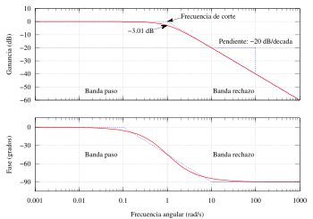
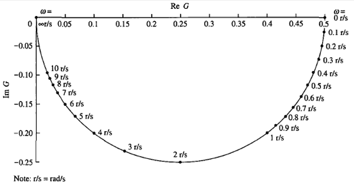
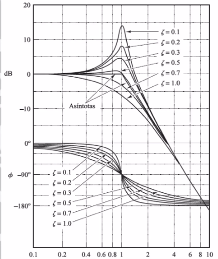
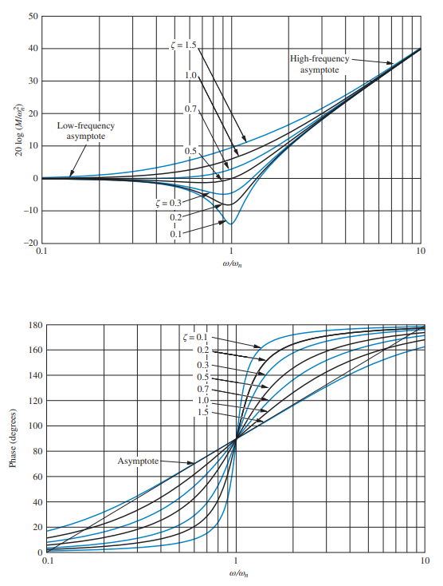

# Análisis en frecuencia y diagramas de Bode
La clase estuvo dirigida al análisis en frecuencia, la cual es una técnica esencial en el diseño y análisis de sistemas de control, especialmente en el ámbito de la instrumentación industrial, debido a que permite evaluar cómo un sistema responde a diferentes frecuencias de entrada, lo que es crucial para garantizar un rendimiento óptimo en aplicaciones industriales.
## 1. Analisis en Frecuencia
El análisis de frecuencia es una técnica que evalúa cómo un sistema dinámico responde a diferentes frecuencias de entrada, permitiendo observar cambios en amplitud y fase. Su importancia radica en que ayuda a entender el comportamiento del sistema, optimizar su rendimiento y diseñar controladores efectivos. Es utilizada para evaluar la respuesta de sistemas dinámicos lineales a entradas periódicas, especialmente señales sinusoidales.Además, facilita la identificación de características críticas como la estabilidad y la resonancia en sistemas de control.

### 1.1 Representacion Matematica
Este analisis tiene una representacion matematica la cual es:
R(t)=Asin(ωkT+ϕ) 
la cual describe la respuesta de un sistema dinámico a una entrada sinusoidal, y se puede desglosar en sus componentes para entender su significado, en donde

R(t):
Representa la salida del sistema en función del tiempo. Puede ser cualquier variable que se esté analizando, como desplazamiento, velocidad, o corriente.

A:
Es la amplitud de la señal. Indica la magnitud máxima de la respuesta del sistema. Un valor mayor de A significa que el sistema responderá con una mayor intensidad a la entrada.

sin:
La función seno es una función periódica que describe oscilaciones. En este contexto, indica que la salida del sistema variará de manera sinusoidal a lo largo del tiempo.

ωk:
Es la frecuencia angular del sistema, medida en radianes por segundo. Se relaciona con la frecuencia f (en hertz) mediante la relación ωk =2πf. Esta frecuencia determina cuántas oscilaciones ocurren en un segundo.

T:
Este término puede representar el tiempo transcurrido o una variable relacionada con el tiempo que afecta a la respuesta del sistema.

ϕ:
Es el desfase o fase inicial de la señal, medida en radianes. Indica cómo se desplaza la onda sinusoidal en el tiempo respecto a una referencia. Un desfase diferente puede cambiar el momento en que se alcanza el valor máximo o mínimo de R(t).

### 1.2 Sistemas en Fasores
Los sistemas en fasores son representaciones de señales sinusoidales que asumen una frecuencia constante, expresando la señal en términos de amplitud y fase. En este contexto, se utilizan para simplificar el análisis de sistemas dinámicos, permitiendo representar tanto la entrada como la salida del sistema de manera más manejable. Esta representación es especialmente útil en el análisis de sistemas lineales, donde se pueden aplicar técnicas de transformada para estudiar su comportamiento en frecuencia.

💡**Ejemplo 1:**  

$$
H(z) = \frac{1}{(z - 0.1)(z - 5)}
$$

$$
H(e^{j\omega T}) = \frac{1}{(e^{j\omega T} - 0.1)(e^{j\omega T} - 5)}
$$

$$
H(e^{j\omega T}) = \frac{1}{(\cos(\omega T) + j\sin(\omega T) - 0.1)(\cos(\omega T) + j\sin(\omega T) - 5)}
$$

$$
H(e^{j\omega T}) = \frac{1}{\cos^2(\omega T) - \sin^2(\omega T) - 5.1\sin(\omega T) - 5.1\cos(\omega T) + 0.5 + j2\cos(\omega T)\sin(\omega T)}
$$

## 2. Diagramas de Frecuencia

Cualquier función de transferencia puede dividirse en sus componentes real e imaginaria, lo que permite calcular la magnitud y la fase en el dominio de la frecuencia. Esta separación es crucial para entender cómo un sistema reacciona a distintas frecuencias, ya que proporciona información esencial sobre su comportamiento dinámico. Los resultados obtenidos se pueden graficar en un plano, facilitando así la visualización de la relación entre magnitud y fase.
Los datos pueden representarse en escalas lineales o logarítmicas (en decibelios), lo que mejora su interpretación. También es posible graficar la magnitud frente a la fase utilizando coordenadas polares, lo que ofrece una representación más clara del comportamiento del sistema. Esta visualización relevante para el análisis y diseño de sistemas de control, ya que permite identificar características clave como la estabilidad y el rendimiento bajo diversas condiciones operativas.

💡**Figura 1:**  

Figura 1. Diagrama de Bode.

Un diagrama de Bode es una herramienta gráfica que se utiliza para analizar cómo un sistema responde a diferentes frecuencias. Consiste en dos gráficos: uno que muestra la magnitud (o ganancia) en decibelios y otro que representa la fase en grados, ambos en función de la frecuencia. Este tipo de representación permite entender el comportamiento de circuitos eléctricos y sistemas de control, facilitando la identificación de características importantes como la estabilidad y el rendimiento del sistema.

💡**Figura 2:**  

Figura 2. Diagrama Polar.

El diagrama polar es una representación gráfica que muestra cómo un sistema responde a diferentes frecuencias, utilizando coordenadas polares. En este tipo de diagrama, la magnitud de la respuesta se representa radialmente desde el centro, mientras que la fase se indica en dirección angular. Esto permite visualizar de manera clara y compacta la relación entre magnitud y fase a medida que varía la frecuencia.

### 2.1. Análisis Frecuencial en Tiempo Discreto
El análisis frecuencial en tiempo discreto se refiere a cómo se estudian las señales que están definidas solo en momentos específicos, es decir, en puntos discretos de tiempo. Este tipo de análisis es fundamental para entender cómo las señales cambian con el tiempo y cómo se comportan frente a diferentes frecuencias. Para llevar a cabo este análisis, se utilizan herramientas matemáticas como la Transformada de Fourier y la Transformada Z, que permiten descomponer una señal en sus componentes de frecuencia. Debido a que no es posible hacer el analisis en frecuencia directamente en timepo completo se utiliza la transformación bilineal, también conocida como transformación de Tustin, la cual es una técnica matemática utilizada en el diseño de filtros digitales y sistemas de control, tiene como principal función convertir funciones de transferencia analógicas (que operan en el dominio continuo) a sus equivalentes discretos (en el dominio digital). Este proceso se realiza mediante un mapeo que relaciona el plano complejo s (utilizado en sistemas continuos) con el plano z (usado en sistemas discretos), permitiendo así que las características del sistema se mantengan durante la transformación.

En la transfomación se utilizan los planos s, z y w son herramientas fundamentales en el análisis de sistemas tanto continuos como discretos. El plano s se centra en el comportamiento dinámico de sistemas analógicos, el plano z se utiliza para sistemas digitales, y el plano w ayuda a visualizar transformaciones complejas. Juntos, estos planos permiten a los ingenieros diseñar y analizar sistemas con un enfoque más profundo y preciso.

En estado estacionario, las entradas sinusoidales a un sistema lineal generan respuestas sinusoidales de la misma frecuencia. Aunque estas respuestas son de la misma frecuencia que la entrada, difieren en amplitud y ángulo de fase con respecto a la entrada. Estas diferencias son funciones de la frecuencia. Las sinusoides pueden ser representadas como números complejos llamados fasores. La magnitud del número complejo es la amplitud de la sinusoide, y el ángulo del número complejo es el ángulo de fase de la sinusoide. Así, M1 * cos (ωt+ ϕ1) puede ser representado como M1 < ϕ1 donde la frecuencia, ω es implícita. Dado que un sistema provoca cambios tanto en la amplitud como en el ángulo de fase de la entrada, podemos pensar en el sistema mismo como representado por un número complejo, definido de tal manera que el producto del fasor de entrada y la función del sistema produzca la representación fasorial de la salida.

💡**Ejemplo 3:**  

$$
G_s = \frac{1}{s + 10}
$$

$$
G_z = \frac{0.06321}{z - 0.3679}
$$

$$
G_w = \frac{0.924 (- 0.05w + 1)}{w + 9.242}
$$

## 3. Diagramas de Bode

Los diagramas de Bode, también conocidos como diagramas logarítmicos, son herramientas gráficas que ayudan a analizar cómo un sistema responde a diferentes frecuencias. Un diagrama de Bode consta de dos gráficos: uno muestra el logaritmo de la magnitud de la función de transferencia (que indica cuánta señal se amplifica o atenúa) y el otro representa el ángulo de fase (que indica el desplazamiento temporal de la señal). Ambos gráficos se trazan en función de la frecuencia, utilizando una escala logarítmica. La ventaja principal de los diagramas de Bode es que convierte la multiplicación de magnitudes en suma, lo que simplifica los cálculos. También permite dibujar curvas aproximadas utilizando líneas rectas, lo que es útil para obtener una idea general del comportamiento del sistema. Si se necesita mayor precisión, es fácil ajustar estas curvas.

💡**Figura 3:**  

Figura 3. Diagrama de Bode y su efecto en los Polos.

$$
\frac{1}{w^2 + 2ζω_n w + ω_n^2}
$$

Si 0 < ζ < 1 la curva de magnitud presenta un pico de resonancia. A medida que ζ disminuye el pico resonancia aumenta. Para ζ > 1 la gráfica ya no presenta pico de resonancia. Después del corte la curva presenta una pendiente de - 40dB/dec.

Para el caso de la fase, si ζ es pequeña la curva presenta cambios bruscos cerca de ω= ωn. Si ζ > 1 los cambios son menos bruscos por lo que la curva es mas suave.

💡**Figura 4:**  

Figura 4. Diagrama de Bode y su efecto en los Zeros.

$$
w^2 + 2ζω_n w + w_n^2
$$

Encontramos que la curva de magnitud presenta un quiebre en la frecuencia natural y disminuye a una tasa de -40 dB/decada. El gráfico de fase es 0° a bajas frecuencias. A 0.1 ωn, comienza a disminuir -90°/decada y continúa hasta ω = 10ωn, donde se estabiliza en -180°.

Por medio de las respuestas se puede establecer una relacion entre la respuesta en frecuencia en lazo abierto con respecto a la respuesta temporal en lazo cerrado:

$$
\zeta = \sqrt{\frac{(\ln(M_p))^2}{\pi^2 + (\ln(M_p))^2}}
$$

$$
M_r = \frac{1}{2\sqrt{\frac{(\ln(M_p))^2}{\pi^2 + (\ln(M_p))^2}} \sqrt{1 - \frac{(\ln(M_p))^2}{\pi^2 + (\ln(M_p))^2}} \cdot}
$$

## 3. Ejercicios
FALTANNNN

## 4. Conclusiones
*
*
*
## 5. Referencias
[1] "Apuntes Clase - Jueves 19 Septiembre 2024"  
[2] "Ingeniería de control Moderno, Ogata"  
[3] "Diseño de control Análogo y Digital, Chen"  
[4] "E.P.1. Control digital y de mov-05909-2463 - Aulas ECCI"  
