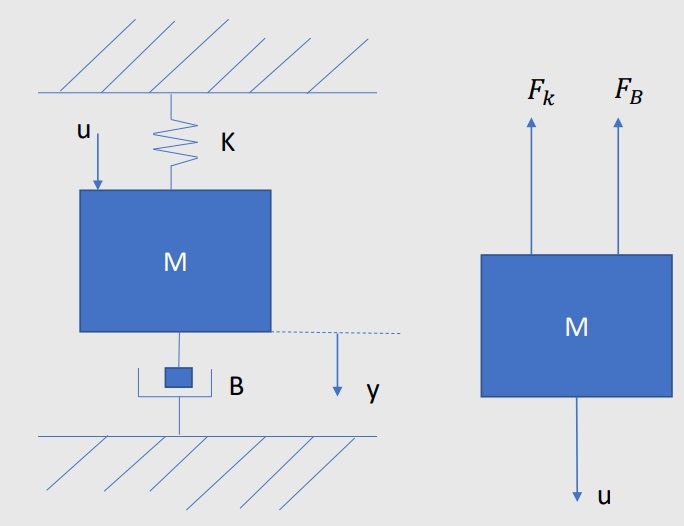

# Espacio de Estados 
La clase estuvo dirigida a comprender el concepto de espacio de estados, una representación matemática de sistemas dinámicos que incluye no solo las entradas y salidas, sino también variables internas que describen completamente el comportamiento del sistema. Se exploraron las diferencias entre la representación interna, que utiliza variables de estado y ecuaciones de estado, y la representación externa, que se basa en funciones de transferencia. Se enfatizó la importancia del espacio de estados en el análisis de propiedades críticas como la controlabilidad y la observabilidad, especialmente en sistemas complejos como los MIMO (Múltiples Entradas, Múltiples Salidas).

## 1. Espacio de Estados 
El espacio de estados, segun Ogata, es una representación matemática de los sistemas dinámicos que no solo considera las entradas y salidas, sino también otras variables que ayudan a representar de manera más precisa la dinámica del sistema. Esta representación, conocida como representación interna, utiliza variables de estado para describir completamente el comportamiento del sistema en un momento dado, estableciendo relaciones a través de ecuaciones de estado y ecuaciones de salida. En contraste, la función de transferencia se conoce como representación externa, ya que se centra en la relación entre las entradas y salidas sin considerar las variables internas. La flexibilidad del espacio de estados para abordar sistemas complejos facilita el análisis de propiedades críticas como la controlabilidad y la observabilidad, convirtiéndolo en una herramienta invaluable en diversas aplicaciones, desde la ingeniería eléctrica hasta la robótica, donde se requiere un control preciso y efectivo.

💡**Figura 1:**  

La representacion de estados permite representar sistemas MIMO (Multiple Inputs Multiple Output) las cuales son un poco mas complejas que simplemente las SISO (Single Input Single Output), debido a que permiten representar cambios en el modelo a medida que transcurre el tiempo como lo es un carro autonomo en la Figura 1.

### 1.1 Estado:
Es el conjunto de variables que permiten conocercompletamente el comportamiento de un sistema.

### 1.2 Variables de estado: 
Son las variables que determinan el comportamiento de un Sistema y no necesariamente son medibles.

### 1.3 Ecuaciones de Estados: 
Son un conjunto de varias ecuaciones que describen la dinámica de un sistema mediante un modelo matemático. Este modelo se basa en la relación entre las variables de entrada, salida y estado del sistema.

## Representación Matematica:

Para realizar esta representacion matematica se al menos se debe tener dos varibles de estado, de no ser asi se podria realizar por medio de funcion de transferencia o ecuacion diferencial.

* Ecuación de estado:
  
$$ X(k+1) = f(X(k), U(k), k)$$

* Ecuación de salida:
  
$$Y(k) = g(X(k), U(k), k) $$

Tienen como carateristicas que característicasque Las funciones f y g pueden ser no lineales y dependen del tiempo.

## 2. Representacion Matricial:

$$
X(k + 1) = A(k) \cdot X(k) + B(k) \cdot u(k)
$$

$$
y(k) = C(k)X(k) + D(k)u(k)
$$

Simplificando queda:

$$
X(k + 1) = AX(k) + Bu(k)
$$

$$
y(k) = CX(k) + Du(k)
$$

Donde:
- **A**: Matriz de estados, la cual describe la dinámica del sistema y relaciona el estado actual del sistema con su evolución futura.
- **B**: Matriz de entrada, que relaciona las entradas del sistema con los estados, determinando cómo las señales de entrada afectan la evolución del estado.
- **C**: Matriz de salida, la cual conecta los estados del sistema con las salidas, permitiendo la observación del comportamiento del sistema a partir de sus estados internos.
- **D**: Matriz de transmisión directa, que representa la relación directa entre las entradas y las salidas, indicando cómo una entrada afecta inmediatamente a la salida sin pasar por el estado del sistema.

💡**Ejemplo 1:**  

* Ecuación Diferencial

$$
u(t) - F_k - F_B = m \cdot a
$$

$$
u(t) - K y(t) - B \dot{y}(t) = M \ddot{y}(t)
$$

* La ley de Hooke se expresa como:

$$
K y(t) ---> F_k = k \cdot x
$$

Donde x es la elongación del resorte. .

* Fuerza del Amortiguador:

$$
B \dot{y}(t) ---> F_b = B^* \frac{dx}{dt}
$$

Se discretiza la siguiente ecuación:

$$
u(t) - K y(t) - B \dot{y}(t) = M \ddot{y}(t)
$$

$$
\frac{d}{dkT} x(kT) = \frac{x(k + 1) - x(k)}{T}
$$

$$
M Y(k + 2) - 2M Y(k + 1) + M Y(k) + B T Y(k + 1) - B T Y(k) + T^2 K Y(k) = U T^2
$$

$$
M Y(k + 2) + (B T - 2M) Y(k + 1) + (M - B T + T^2 K) Y(k) = U(k) T^2
$$

## 3. Metodologia: 

- Despejar el Máximo Adelanto de la Ecuación en Diferencias: Identificar y despejar el término que tiene el mayor adelanto temporal (es decir, el término que representa la próxima instancia del sistema). Esto es crucial porque permite establecer una relación clara entre los estados actuales y futuros del sistema. En general, se busca expresar la variable dependiente (como la salida o el estado) en función de sus valores anteriores y las entradas.
- Igualar la Salida a la Variable de Estado: Se establece que la salida del sistema es igual a una de las variables de estado. Esto es fundamental para definir cómo las variables de estado influyen en las salidas del sistema.
- Desplazar Sucesivamente para Obtener las Derivadas de las Variables de Estado: Este paso implica tomar derivadas sucesivas (o diferencias) de las variables de estado para obtener sus tasas de cambio. Dependiendo del tipo de sistema (discreto o continuo), se pueden usar derivadas o diferencias finitas.
- Organizar los Términos de las Ecuaciones de Estado dentro de las Matrices A, B, C y D: Finalmente, todos los términos obtenidos se organizan dentro de matrices específicas.

💡**Ejemplo 2:**  

$$y(k+2) + y(k+1) + 0.16y(k) = 2u(k)$$
Despejando la maxima derivada: $$y(k+2) = -y(k+1) - 0.16y(k) + 2u(k)$$
Entonces:
$$y(k) = x_1(k)$$
$$y(k + 1) = x_{1}(k + 1) = x_{2}(k)$$
$$y(k + 2) = x_{2}(k + 1) = -x_{2}(k) - 0.16 x_{1}(k) + 2 u(k)$$

$$ \begin{bmatrix}
\chi_1(k + 1) \\
\chi_2(k + 2)
\end{bmatrix}
=\begin{bmatrix}
0 & 1 \\
-0.16 & -1
\end{bmatrix}
\begin{bmatrix}
\chi_{1}(k) \\
\chi_{2}(k)
\end{bmatrix}
+
\begin{bmatrix}
0 \\
2
\end{bmatrix}
u
$$

$$
y = 
\begin{bmatrix}
1 & 0
\end{bmatrix}
\begin{bmatrix}
x_{1}(k) \\
x_{2}(k)
\end{bmatrix}
+ 
\begin{bmatrix}
0
\end{bmatrix} u
$$

## 3. Conclusiones
* En los sistemas de control, las redes de atraso son esenciales porque mejoran la precisión en estado estable, lo que permite que el sistema funcione de manera más confiable, estas se utilizan para reducir la ganancia a altas frecuencias, evitar oscilaciones indeseables y mejorar la estabilidad del sistema. Sin embargo, debido a que su uso puede prolongar el tiempo de respuesta transitoria, se utilizan con frecuencia junto con compensadores de adelanto para optimizar ambos aspectos.
* Los controladores PID tienen redes de atraso y adelanto lo que proporciona mayor flexibilidad en el diseño, esta combinación puede compensar tanto retrasos como avances en el sistema, lo que mejora su rendimiento y capacidad de respuesta en todo el sistema. Además, el proceso de diseño y ajuste de estas redes permite una comprensión de la dinámica del sistema, que contribuye al analisis y la optimización continua de sistemas de control.

## 4. Referencias
[1] "Apuntes Clase - Jueves 26 Septiembre 2024"  
[2] "Ingeniería de control Moderno, Ogata"  
[3] "Diseño de control Análogo y Digital, Chen"  
[4] "E.P.1. Control digital y de mov-05909-2463 - Aulas ECCI"  

