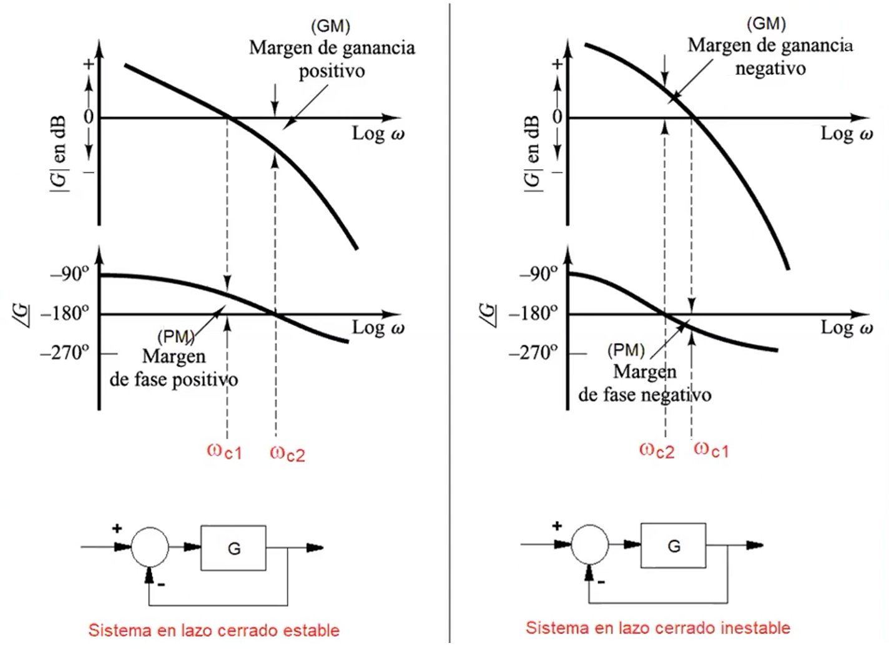

# Espacio de Estados 
La clase estuvo dirigida en comprender 

## 1. CXXXXXXXXXXXXXXXXX
El espacio de estados, segun Ogata, es una representación matemática de los sistemas dinámicos que no solo considera las entradas y salidas, sino también otras variables que ayudan a representar de manera más precisa la dinámica del sistema. Esta representación, conocida como representación interna, utiliza variables de estado para describir completamente el comportamiento del sistema en un momento dado, estableciendo relaciones a través de ecuaciones de estado y ecuaciones de salida. En contraste, la función de transferencia se conoce como representación externa, ya que se centra en la relación entre las entradas y salidas sin considerar las variables internas. La flexibilidad del espacio de estados para abordar sistemas complejos facilita el análisis de propiedades críticas como la controlabilidad y la observabilidad, convirtiéndolo en una herramienta invaluable en diversas aplicaciones, desde la ingeniería eléctrica hasta la robótica, donde se requiere un control preciso y efectivo.

💡**Figura 1:**  

La representacion de estados permite representar sistemas MIMO (Multiple Inputs Multiple Output) las cuales son un poco mas complejas que simplemente las SISO (Single Input Single Output), debido a que permiten representar cambios en el modelo a medida que transcurre el tiempo como lo es un carro autonomo en la Figura 1.

### 1.1 Estado:
Es el conjunto de variables que permiten conocercompletamente el comportamiento de un sistema.

### 1.2 Variables de estado: 
Son las variables que determinan el comportamiento de un Sistema y no necesariamente son medibles.

### 1.3 Ecuaciones de Estados: 
Son un conjunto de varias ecuaciones que describen la dinámica de un sistema mediante un modelo matemático. Este modelo se basa en la relación entre las variables de entrada, salida y estado del sistema.

## Representación Matematica:

Para realizar esta representacion matematica se al menos se debe tener dos varibles de estado, de no ser asi se podria realizar por medio de funcion de transferencia o ecuacion diferencial.

* Ecuación de estado:
  
$$ X(k+1) = f(X(k), U(k), k)$$

* Ecuación de salida:
  
$$Y(k) = g(X(k), U(k), k) $$

Tienen como carateristicas que característicasque Las funciones f y g pueden ser no lineales y dependen del tiempo.

## 2. Representacion Matricial:

$$
X(k + 1) = A(k) \cdot X(k) + B(k) \cdot u(k)
$$

$$
y(k) = C(k)X(k) + D(k)u(k)
$$

Simplificando queda:

$$
X(k + 1) = AX(k) + Bu(k)
$$

$$
y(k) = CX(k) + Du(k)
$$

Donde:
- **A**: Matriz de estados, la cual describe la dinámica del sistema y relaciona el estado actual del sistema con su evolución futura.
- **B**: Matriz de entrada, que relaciona las entradas del sistema con los estados, determinando cómo las señales de entrada afectan la evolución del estado.
- **C**: Matriz de salida, la cual conecta los estados del sistema con las salidas, permitiendo la observación del comportamiento del sistema a partir de sus estados internos.
- **D**: Matriz de transmisión directa, que representa la relación directa entre las entradas y las salidas, indicando cómo una entrada afecta inmediatamente a la salida sin pasar por el estado del sistema.

💡**Ejemplo 1:**  

* Ecuación Diferencial

$$
u(t) - F_k - F_B = m \cdot a
$$

$$
u(t) - K y(t) - B y(t) = M \ddot{y}(t)
$$

* La ley de Hooke se expresa como:

$$
F_k = k \cdot x
$$

Donde x es la elongación del resorte. .

* Fuerza del Amortiguador:

$$
F_b = B^* \frac{dx}{dt}
$$

### 1.1 Control PID 

Un controlador PID (Proporcional, Integral y Derivativo) es un mecanismo de control ampliamente utilizado en sistemas de automatización y control industrial. Su función principal es regular variables como temperatura, presión, velocidad y flujo, mediante un lazo de retroalimentación que ajusta continuamente las salidas en función de la diferencia entre un valor deseado (set-point) y el valor medido del proceso. Tiene tres aspectos fundamentales loscuales son:

*Proporcional (P): Este componente genera una salida proporcional al error actual. Cuanto mayor sea el error, mayor será la acción correctiva aplicada. Esto permite una respuesta rápida a las variaciones.
*Integral (I): Este término acumula el error a lo largo del tiempo, corrigiendo cualquier desviación persistente del set-point. Ayuda a eliminar el error en estado estacionario, pero puede causar oscilaciones si no se sintoniza adecuadamente.
*Derivativo (D): Este componente anticipa futuros errores basándose en la tasa de cambio del error actual. Proporciona una acción correctiva que ayuda a suavizar la respuesta del sistema y reduce el sobreimpulso.

El control PID puede considerarse un caso especial de una red de atraso-adelanto, ya que combina las características de ambos tipos de compensación. En un controlador PID, se integran tres acciones proporcional, integral y derivativa, lo que permite mejorar tanto la respuesta transitoria como la precisión en estado estacionario. La parte proporcional actúa como un compensador de adelanto, aumentando la rapidez de respuesta, mientras que la parte integral ayuda a eliminar el error en estado estacionario, similar al efecto de un compensador de atraso. Al combinar estas funciones, el controlador PID optimiza el rendimiento del sistema, mejorando los márgenes de estabilidad y el ancho de banda.

### 1.2  Márgenes de fase y ganancia

#### Margen de Ganancia
El margen de ganancia es la cantidad que se puede aumentar la ganancia del sistema antes de que se produzca inestabilidad. Se expresa como un factor o en decibelios (dB). Un margen de ganancia positivo indica que el sistema puede soportar incrementos en la ganancia sin volverse inestable. 
El margen de ganancia se define como la diferencia entre la ganancia del sistema en el punto donde la fase alcanza -180 grados y 0 dB. En términos matemáticos, si G(jω) es la función de transferencia del sistema, el margen de ganancia Gm se puede calcular como:

$$
G_m = \frac{1}{|G(j\omega_c)|}
$$

Donde ωc es la frecuencia de cruce de fase, es decir, la frecuencia en la que la fase del sistema es 180 grados. Si ∣G(jωc)∣ es mayor que 1 (0 dB), el margen de ganancia será positivo, lo que indica estabilidad. Si es igual a 1, el sistema estará marginalmente estable, y si es menor que 1, el sistema será inestable.

El margen de ganancia tiene tres interpretacion de acuerfdo al valor que se obtenga:

* Margen Positivo: Indica que hay un rango seguro para aumentar la ganancia sin comprometer la estabilidad del sistema. MG > o
* Margen Cero: Significa que cualquier aumento adicional en la ganancia llevará al sistema a un estado inestable. MG = 0
* Margen Negativo: Indica que el sistema ya está inestable y no puede tolerar ningún aumento en la ganancia. MG < 0

#### Margen de Fase

El margen de fase mide cuánta variación de fase es necesaria para generar una pérdida de estabilidad en la frecuencia de cruce de ganancias. Se mide en la frecuencia donde la ganancia es igual a 0 dB. El margen de fase es una medición de la distancia desde la fase medida hasta el desplazamiento de fase de -180°. En otras palabras, cuantos grados debe disminuir la fase para alcanzar -180°.

El margen de FASE tiene tres interpretacion de acuerfdo al valor que se obtenga:

* Margen Positivo: Indica que hay un rango seguro para aumentar la ganancia sin comprometer la estabilidad del sistema. MP > −180°
* Margen Negativo: Indica que el sistema ya está inestable y no puede tolerar ningún aumento en la ganancia. MP < −180°

En un diagrama de Bode, el margen de fase se representa como la distancia entre la curva que muestra la fase del sistema y la línea horizontal correspondiente a -180 °, evaluada en la frecuencia donde la ganancia es 0 dB. Cuanto más lejos esté esta curva del -180 °, mayor será el margen de fase y mejor será la estabilidad del sistema.

💡**Figura 1:**  

Figura 1. Medidas de Margenes de Ganancia y Fase en Diagrama de Bode. 

En loa diagramas de bode se puede analizar los margenes de ganancia y de fase. Si los márgenes de ganancia (MG) y de fase (MP) son positivos, el sistema es estable en lazo cerrado; por lo tanto, es deseable que estos márgenes sean lo más grandes posible. Sin embargo, si MG y MP son cero o negativos, el sistema puede volverse inestable en lazo cerrado.

## 2. Redes de Atraso

$$
C_w = \frac{1 + a T_1 w}{1 + T_1 w}; \quad 0 < a < 1
$$

El diseño de una red de atraso para un sistema análogo implica varios pasos que permiten transformar la planta analógica en un sistema discreto, asegurando que se mantenga la estabilidad y el rendimiento deseado. A continuación se detalla el procedimiento:
* Discretización de la Planta Analógica: Comienza por discretizar la función de transferencia de la planta analógica, obteniendo así su equivalente en el dominio Z, denotado como  G(z). Esto se puede lograr utilizando métodos como la transformación bilineal o el método de retención.
* Transformación a Frecuencia: Una vez que se tiene G(z), se transforma a G(w), donde w es la frecuencia en el dominio continuo. Esta transformación permite analizar cómo se comporta el sistema en términos de frecuencia y es crucial para el diseño del compensador.
* Graficar Diagramas de Bode: A partir de G(w), se generan los diagramas de Bode que representan la magnitud y la fase del sistema en función de la frecuencia. Estos gráficos son esenciales para evaluar las características del sistema, como los márgenes de ganancia y fase para evaluar su comportamiento.
Aplicar el Método de Diseño para C(w): Con los diagramas de Bode, se aplica un método de diseño para determinar el compensador C(w). Este paso implica ajustar los parámetros del controlador para lograr los márgenes deseados y mejorar la estabilidad del sistema.
* Recuperar C(z): Se transforma C(w) a su equivalente en el dominio Z, denotado como C(z). Esto es necesario para poder implementar el controlador en un sistema digital. La relación entre las frecuencias se puede expresar como:

$$
w = \frac{T}{2} \cdot \frac{z + 1}{z - 1}
$$

* Calcular KP: Esto se hace con el fin de garantizar el Requerimiento de error, se determina el valor de la ganancia proporcional que satisfaga los requisitos del sistema, específicamente en términos de error en estado estacionario. Esto implica evaluar la constante de error estacionario y asegurarse de que el sistema pueda alcanzar el nivel deseado de precisión.
* Medicion de Márgenes: Se tiene en cuenta el Kp, luego quese ha establecido, se debe medir los márgenes de ganancia y fase del sistema. Estos márgenes son indicadores clave de la estabilidad del sistema en lazo cerrado. Se utilizan herramientas como diagramas de Bode para visualizar cómo estos márgenes se ven afectados por el ajuste de Kp.
* Calcular Frecuencia: Para poder cumplir con Mp +6°, de debe identificar una nueva frecuencia de cruce donde el margen de fase deseado sea al menos Mp +6°, esta frecuencia se convierte en el nuevo punto donde la ganancia es igual a 0 dB, lo que permite evaluar cómo se comporta el sistema en esta nueva configuración.
* Medir la Atenuación: En este paso, se calcula la atenuación necesaria en la frecuencia seleccionada para cumplir con el margen de fase requerido. La atenuación se puede calcular utilizando la fórmula:

$$
\alpha = -20 \log a
$$

$$
a = 10^{-\frac{\alpha}{20}}
$$

* Calcular T1: Finalmente, se determina el tiempo constante T1 necesario para lograr la atenuación deseada a la frecuencia seleccionada, esto se relaciona con la frecuencia angular ω y se expresa como:

$$
\frac{1}{T_1 a} = \frac{\omega_G}{10}
$$

Donde 𝜔𝐺 es la frecuencia de cruce de la ganancia, y la ganancia que es necesario atenuar en el diagrama (1 década antes de la nueva frecuencia).

## 3. Conclusiones
* En los sistemas de control, las redes de atraso son esenciales porque mejoran la precisión en estado estable, lo que permite que el sistema funcione de manera más confiable, estas se utilizan para reducir la ganancia a altas frecuencias, evitar oscilaciones indeseables y mejorar la estabilidad del sistema. Sin embargo, debido a que su uso puede prolongar el tiempo de respuesta transitoria, se utilizan con frecuencia junto con compensadores de adelanto para optimizar ambos aspectos.
* Los controladores PID tienen redes de atraso y adelanto lo que proporciona mayor flexibilidad en el diseño, esta combinación puede compensar tanto retrasos como avances en el sistema, lo que mejora su rendimiento y capacidad de respuesta en todo el sistema. Además, el proceso de diseño y ajuste de estas redes permite una comprensión de la dinámica del sistema, que contribuye al analisis y la optimización continua de sistemas de control.

## 4. Referencias
[1] "Apuntes Clase - Jueves 26 Septiembre 2024"  
[2] "Ingeniería de control Moderno, Ogata"  
[3] "Diseño de control Análogo y Digital, Chen"  
[4] "E.P.1. Control digital y de mov-05909-2463 - Aulas ECCI"  

